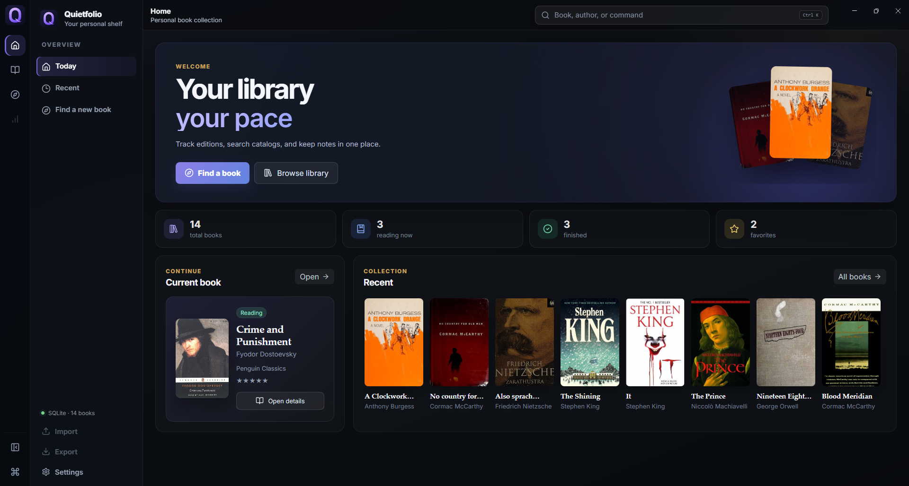
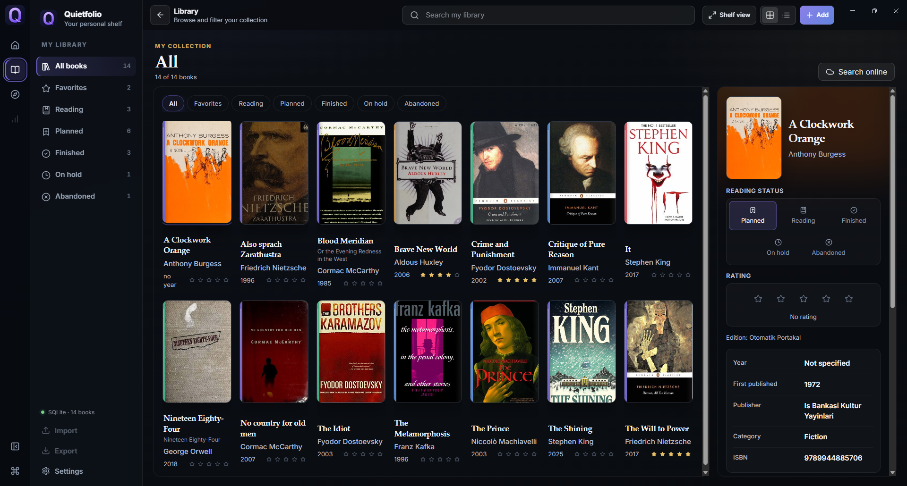
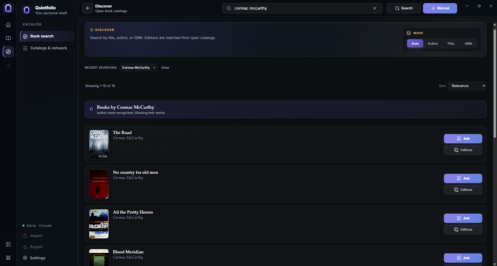

<p align="center">
  
</p>

<h1 align="center">Quietfolio</h1>

<p align="center">
  A local-first desktop app for managing a personal book library
</p>

<p align="center">
  <a href="https://github.com/DamianEhrenburg/quietfolio/actions/workflows/check.yml">
    
  </a>
  <a href="https://github.com/DamianEhrenburg/quietfolio/tags">
    
  </a>
  <a href="LICENSE">
    
  </a>
  
  
  
  
</p>

<p align="center">
  
</p>

<p align="center">
  <sub>Home screen with the current book, recently added titles and library statistics</sub>
</p>

<p align="center">
  
</p>

<p align="center">
  <sub>Library screen with a cover grid, reading filters and book details</sub>
</p>

<p align="center">
  
</p>

<p align="center">
  <sub>Catalog search with edition information and book covers</sub>
</p>

## About

Quietfolio is a local-first desktop application for managing a personal book collection.

It keeps books, editions, covers, reading statuses, favorites, ratings and notes in one place. Library data is stored locally in SQLite, and no account or hosted backend is required.

## Features

* Personal book library with covers and edition information
* Reading statuses, favorites, ratings and notes
* Cover grid with quick filters and a compact details panel
* Online catalog search across FantLab, Wikidata, Open Library, Google Books and Gutendex
* Support for additional optional catalog sources
* Local cover cache using the `quietfolio-cover://` protocol
* Russian and English interface
* Language selection on first launch
* Local SQLite storage
* No account or hosted backend

## Run From Source

### Requirements

* Node.js 20 or newer
* npm 10 or newer

### Development Mode

```bash
git clone https://github.com/DamianEhrenburg/quietfolio.git
cd quietfolio
npm install
npm run dev
```

### Production Build

```bash
npm run build
npm start
```

Google Books integration is optional. An API key can be added in **Settings** to use authenticated requests.

## Development Checks

```bash
npm run check
```

The check command runs:

* ESLint
* TypeScript validation
* Production build
* Asset verification
* Search hint verification

## Privacy and Storage

Library data is stored locally as SQLite files in the Electron `userData` directory.

Optional API keys are stored through Electron `safeStorage` when encryption is available on the operating system.

Quietfolio does not require registration and does not use a hosted backend for the personal library.

## Current Limitations

The following features are not implemented in version `0.5.0`:

* Library import and export
* EPUB and PDF reading
* CBZ support
* Packaged installers

Quietfolio is under active development. Features, interfaces and internal architecture may change between releases.

## Русский

<details>
<summary>Описание на русском языке</summary>

Quietfolio — локальное настольное приложение для ведения домашней библиотеки.

Приложение позволяет хранить книги, издания, обложки, статусы чтения, избранное, оценки и заметки. Данные библиотеки сохраняются локально в SQLite. Регистрация и подключение к отдельному серверу не требуются.

### Возможности

* каталог домашней библиотеки;
* статусы чтения, избранное, оценки и заметки;
* сетка обложек, фильтры и панель информации о книге;
* поиск по FantLab, Wikidata, Open Library, Google Books и Gutendex;
* локальное хранение обложек;
* русский и английский интерфейс;
* выбор языка при первом запуске;
* локальная база данных SQLite.

### Запуск из исходного кода

Для запуска требуются Node.js 20 или новее и npm 10 или новее.

```bash
git clone https://github.com/DamianEhrenburg/quietfolio.git
cd quietfolio
npm install
npm run dev
```

Для сборки и запуска производственной версии:

```bash
npm run build
npm start
```

Ключ Google Books API не является обязательным. При необходимости его можно добавить в настройках приложения.

</details>

## License

Quietfolio is distributed under the [MIT License](LICENSE).

<p align="center">
  <sub>
    Damian Ehrenburg ·
    <a href="https://github.com/DamianEhrenburg">GitHub</a>
  </sub>
</p>
